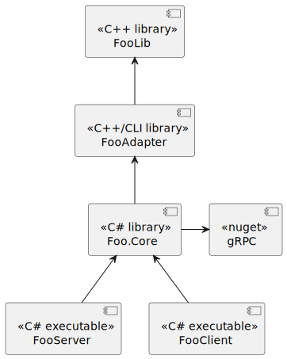

# gRPC CLIアダプタ

C++/windowsでgRPCはいろいろメンドウなので、CLIアダプタを試してみた.

# overview

- FooLib
- FooAdapter
- Foo.Core
- FooServer
- FooClient

# Tips

## C++標準ヘッダが`/cli`に対応していない

- `<thread>`は対応していなかった
- C++/CLIライブラリ内にC++コードを直接含めてしまう方法ではなく、C++/CLIコードととC++コードを分離してしまう方が無難か...

## `System.BadImageFormatException` が発生する

- C#アプリの`32ビットを優先`のチェックを外す

## デストラクタ・ファイナライザ [C++/CLI]

- `~Foo()`: デストラクタ
- `!Foo()`: ファイナライザ
- デストラクタが呼び出されている場合、ファイナライザは呼び出されない
    - デストラクタからファイナライザを呼び出すのが一般的？
