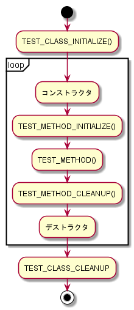

# Microsoft Unit Testing Framework for C++

Visual Studio付属のMicrosoft製C++テストフレームワークの`Microsoft Unit Testing Framework for C++`のサンプル

# overview

- FooTest
    - プロジェクトの追加から`ネイティブ単体テスト プロジェクト`を選択して作成したテストプロジェクト
- BarTest
    - `空のプロジェクト`から作成したテストプロジェクト
- VSTestConsoleRunSample
    - VisualStudioではなくQtCreatorを利用
    - `vstest.console.exe`を用いてテスト実行したバージョン

# 実行順序



- テストメソッド毎にテストクラスが生成されているっぽい（テストクラス毎にコンストラクタが呼び出されている）

# 空のプロジェクトから作成する

- 構成を`ダイナミックライブラリ(.dll)`に設定する
- インクルードパスに以下を設定する
    - `$(VCInstallDir)Auxiliary\VS\UnitTest\include`
- ライブラリパスに以下を設定する
    - `$(VCInstallDir)Auxiliary\VS\UnitTest\lib`
    - libファイル自体は設定しなくてもよい

# コンソールランナー

- `vstest.console.exe`を使う
    ```
    > vstest.console.exe FooTest.dll BarTest.dll
    ```
- 場所: VS2017 communityの場合
    - `C:\Program Files (x86)\Microsoft Visual Studio\2017\Community\Common7\IDE\CommonExtensions\Microsoft\TestWindow`

# Qt Creatorによるテスト実行

実行時の設定例


# 参考

- [
Use the Microsoft Unit Testing Framework for C++ in Visual Studio](https://github.com/MicrosoftDocs/visualstudio-docs/blob/master/docs/test/how-to-use-microsoft-test-framework-for-cpp.md)
- [Microsoft.VisualStudio.TestTools.CppUnitTestFramework API reference](https://github.com/MicrosoftDocs/visualstudio-docs/blob/master/docs/test/microsoft-visualstudio-testtools-cppunittestframework-api-reference.md)
